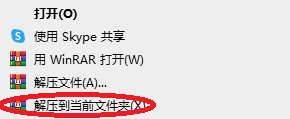
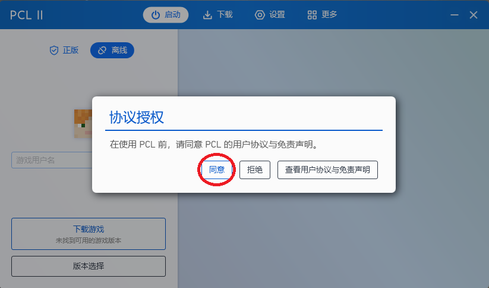
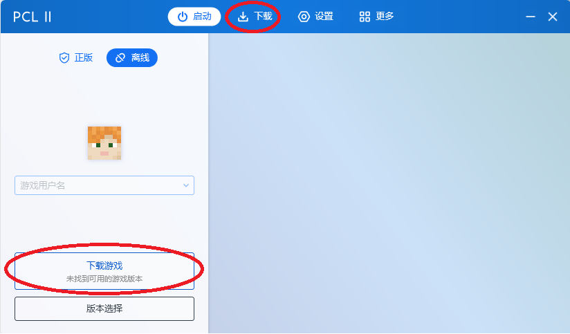
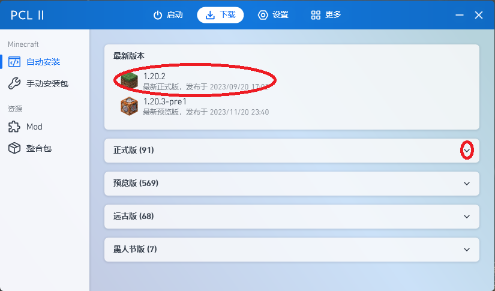
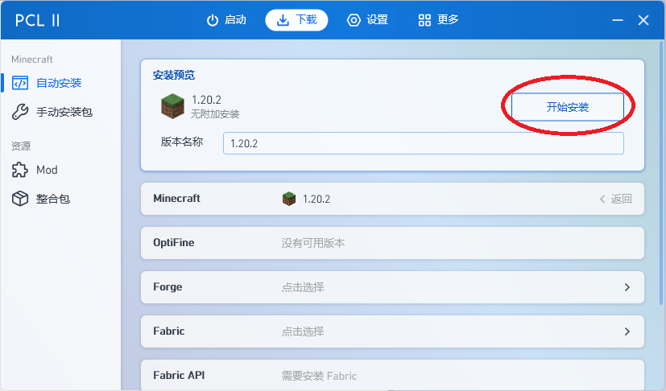
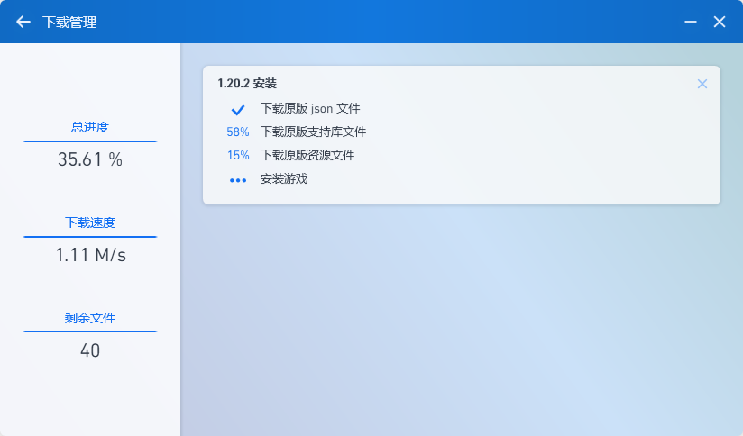
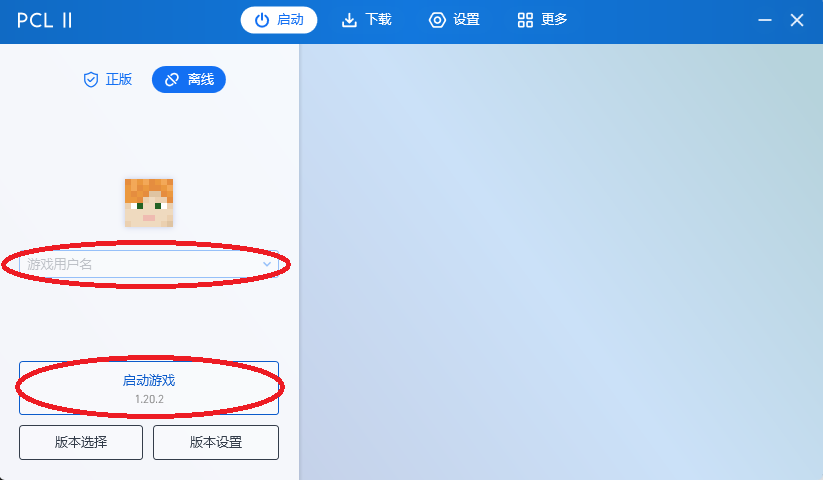
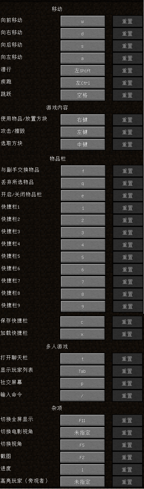

# Minecraft, 启动!    
## 下载链接  
[启动器下载 (必须)](https://moqxlg.dm.files.1drv.com/y4mp19CUC8IAFBPChncY5ErspSIrQiP7G2BzwwaE7-VTclbH6IQMlCpTaS6g-LoYX36-0Q4Btrb4usSEjcZIVHwJkclx_N8hvRXQiuw466wFaVwrupFx7ilD98oAI7uRH3LyN4VbojEjCHcKm23NSb7wvTs9cTxNmPO5dLuV6l9yZsAlzG4RSYH-V_1bpFukE30xbxct2OU6TZfXnqn27P2EguMWzH2LInQIQb3081iN5A?AVOverride=1)    
[脱控](https://gitee.com/grstudio/ydglm/raw/master/JiYuTrainer.exe)(账户grstudio,密码GRS_123456)   
## 安装方法  
对下载后的文件右键，选择“解压到当前文件夹”  

   
打开解压的文件夹，并代开内部的文件夹，打开其中的“Plain Craft Launcher 2”。  

   
随后，点击“下载”或“下载游戏”。  

   

在“下载”中，选择最新正式版本，或在“正式版”中选择你需要的版本，这里以 1.20.2 版本为例。  

  

选中版本后，点击“开始安装”。    

   

接下来，等待安装完成。  

   

安装完成后，点击“游戏用户名”，随便输入一个名字，然后点击“开始游戏”。  

   

## 游戏操作

